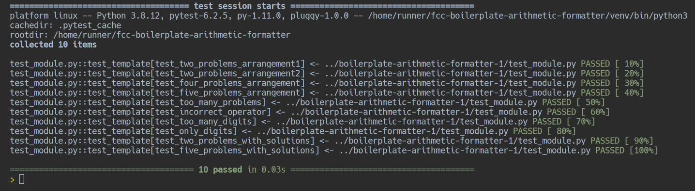

_This README.md file is in English and Portuguese. // Esse arquivo README.md está em Inglês e Português._

# EN: Freecodecamp #01 Scientific Computing with Python: Arithmetic Formatter

This respository contains my solution to the FreeCodeCamp #01 challenge on the "Scientific Computing with Python" 
trail: [the arithmetic-formatter](https://www.freecodecamp.org/learn/scientific-computing-with-python/scientific-computing-with-python-projects/arithmetic-formatter).

## Contents 
This repository contains:
1. main.py
2. arithmetic_formatter.py

## Repl.it version

But, beware: I highly recommend you to run the repl.it version of this code because it contains the tests required 
to be successful on this challenge. You can run the repl.it version on my repl.it public repository here: 
[fcc-boilerplate-arithmetic-formatter](https://replit.com/@barbaracalderon/fcc-boilerplate-arithmetic-formatter#arithmetic_arranger.py)

Cheers,

B.

# PT: Freecodecamp #01 Scientific Computing with Python: Arithmetic Formatter

Esse repositório contém a minha solução para o desafio #01 do FreeCodeCamp na trilha "Scientific Computing with 
Python":  [the arithmetic-formatter](https://www.freecodecamp.org/learn/scientific-computing-with-python/scientific-computing-with-python-projects/arithmetic-formatter).

## Conteúdos
Esse repositório contém:
1. main.py
2. arithmetic_formatter.py

## Versão Repl.it

Mas, atenção: eu recomendo executar a versão desse código no repl.it porque lá têm os testes necessários para ser 
bem-sucedido neste desafio. Você pode executar a versão repl.it no meu repositório repl.it público aqui: 
[fcc-boilerplate-arithmetic-formatter](https://replit.com/@barbaracalderon/fcc-boilerplate-arithmetic-formatter#arithmetic_arranger.py)

Saudações,

B.
